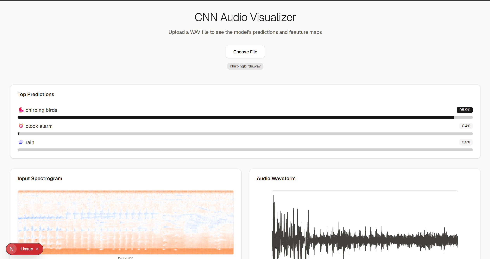
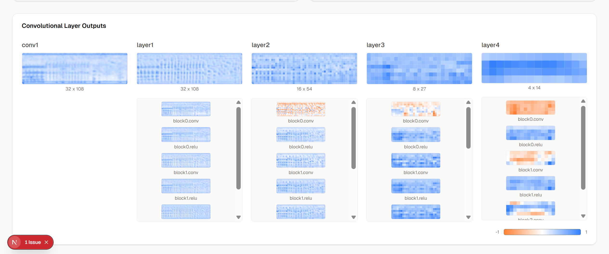

# Audio CNN Visualizer




## Overview
This project is an Audio CNN Visualizer that allows users to upload audio files (WAV format), sends them to a backend for inference, and visualizes the model's predictions and feature maps. The frontend is built with Next.js and the backend is served via a Python API (e.g., FastAPI, Modal, etc.).

## Features
- Drag-and-drop or file upload for audio files
- Visualization of model predictions with confidence
- Display of feature maps and audio waveforms
- Responsive and modern UI

## Project Structure
- `audio-cnn-visualisation/` — Next.js frontend
- `main.py`, `model.py` — Python backend for inference
- `chirpingbirds.wav` — Example audio file

## Getting Started

### Prerequisites
- Node.js (for frontend)
- Python 3.8+ (for backend)

### Frontend Setup
```bash
cd audio-cnn-visualisation
npm install
# Add your backend URL to .env.local
# Example:
# NEXT_PUBLIC_API_URL=https://your-backend-url
npm run dev
```

### Backend Setup
```bash
# (Example for FastAPI)
pip install -r requirements.txt
uvicorn main:app --reload
```

## Deployment
- Deploy the backend (e.g., on Modal, Render, Heroku, etc.)
- Deploy the frontend (e.g., on Vercel or Netlify)
- Set the `NEXT_PUBLIC_API_URL` environment variable in your frontend deployment to point to your backend

## Usage
1. Open the frontend in your browser.
2. Upload a WAV file.
3. View predictions and visualizations.

## License
MIT 