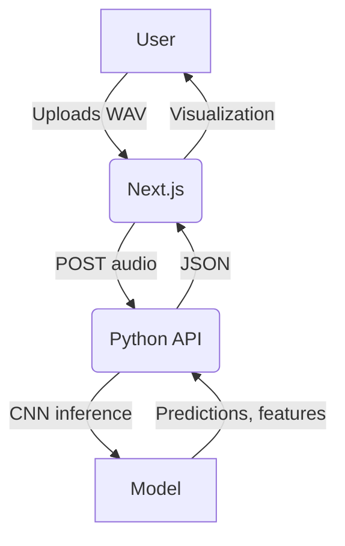

# Audio CNN Visualizer


---

## Overview

**Audio CNN Visualizer** is a full-stack application for audio classification and deep learning visualization. Users can upload WAV audio files, which are sent to a backend (Python, e.g., FastAPI) for inference using a Convolutional Neural Network (CNN). The frontend, built with Next.js and React, visualizes the model's predictions, feature maps, and audio waveforms in an interactive UI.

---

## Features
- Upload and analyze WAV audio files
- Real-time display of top predictions with confidence scores and emojis
- Visualization of feature maps from CNN layers
- Interactive waveform and spectrogram display
- Responsive, modern UI (Next.js, Tailwind CSS)
- Easy backend integration via environment variable

---

## Project Structure
```
audio-cnn-main/
│
├── audio-cnn-visualisation/      # Next.js frontend
│   ├── src/
│   │   ├── app/
│   │   │   ├── layout.tsx
│   │   │   └── page.tsx          # Main UI logic, file upload, API call, visualization
│   │   ├── components/
│   │   │   ├── FeatureMap.tsx    # Feature map visualization
│   │   │   ├── Waveform.tsx      # Waveform visualization
│   │   │   └── ...               # UI components
│   │   └── lib/
│   │       └── utils.ts          # Utility functions
│   └── public/
│       └── favicon.ico
│
├── main.py                       # Python backend entry (FastAPI, etc.)
├── model.py                      # CNN model definition and loading
├── requirements.txt              # Python dependencies
├── chirpingbirds.wav             # Example audio file
└── README.md
```

---

## Theory: How the Machine Learning Works

### 1. **Audio Preprocessing**
- The backend receives a WAV file, decodes it, and normalizes the waveform.
- The waveform is converted to a **spectrogram** (time-frequency representation) using STFT or Mel-spectrogram.
- The spectrogram is treated as an image and fed into the CNN.

### 2. **Convolutional Neural Network (CNN) for Audio**
- **Convolutional layers** scan the spectrogram with learnable filters, extracting local time-frequency patterns.
- **Activation functions** (e.g., ReLU) introduce non-linearity.
- **Pooling layers** reduce dimensionality and focus on salient features.
- **Deeper layers** learn higher-level audio features (e.g., timbre, rhythm).
- The final layers flatten the features and use fully connected layers for classification.

### 3. **Model Training (Typical Pipeline)**
- **Dataset:** Commonly, datasets like ESC-50, UrbanSound8K, or custom audio datasets are used.
- **Augmentation:** Techniques like noise addition, time-shifting, and pitch-shifting improve generalization.
- **Loss Function:** Cross-entropy for classification.
- **Optimization:** Adam or SGD optimizers are used to minimize loss.
- **Validation:** Model performance is tracked on a held-out validation set.

### 4. **Inference and Visualization**
- The backend returns:
  - **Predictions:** Top classes and confidence scores
  - **Feature maps:** Outputs from intermediate CNN layers
  - **Input spectrogram and waveform**
- The frontend visualizes:
  - **Predictions** with emojis and confidence bars
  - **Feature maps** as heatmaps
  - **Waveform and spectrogram** for user insight

### 5. **Model Interpretability & Explainability**
- **Feature maps** help users see what the CNN is "looking at" in the audio.
- **Saliency maps** or Grad-CAM (not implemented here, but possible) can highlight which parts of the spectrogram most influence the prediction.
- **Interactive visualization** helps demystify deep learning for non-experts.

---

## Architecture & Workflow



---

## API Example

**Request:**
```json
POST / (or /predict)
{
  "audio_data": "<base64-encoded-audio>"
}
```
**Response:**
```json
{
  "predictions": [
    {"class": "dog", "confidence": 0.92},
    {"class": "cat", "confidence": 0.05}
  ],
  "visualization": {"conv1": {"shape": [8, 8], "values": [[...], ...]}},
  "input_spectrogram": {"shape": [128, 128], "values": [[...], ...]},
  "waveform": {"values": [...], "sample_rate": 44100, "duration": 2.5}
}
```

---

## Getting Started

### Prerequisites
- Node.js (for frontend)
- Python 3.8+ (for backend)

### Frontend Setup
```bash
cd audio-cnn-visualisation
npm install
# Add your backend URL to .env.local
# Example:
# NEXT_PUBLIC_API_URL=https://your-backend-url
npm run dev
```

### Backend Setup
```bash
pip install -r requirements.txt
uvicorn main:app --reload
```

---

## Deployment

- **Backend:** Deploy on Modal, Render, Heroku, or any cloud provider. Expose a POST endpoint for audio inference.
- **Frontend:** Deploy on Vercel or Netlify. Set the `NEXT_PUBLIC_API_URL` environment variable in your frontend deployment to point to your backend.

---

## Usage

1. Open the frontend in your browser.
2. Upload a WAV file.
3. View predictions, feature maps, and waveform visualizations.
4. Explore the interactive UI for more details.

---

## Troubleshooting

- **Build or Lint Errors:** Ensure your code matches the latest pushed version and all lint errors are fixed before deploying.
- **API Errors:** Check that your backend is running and accessible from the frontend. Update `NEXT_PUBLIC_API_URL` as needed.
- **Large Files:** Do not commit `venv/` or large model files to git. Use `.gitignore` and requirements.txt.

---


